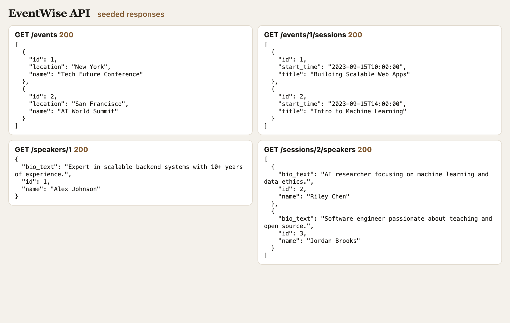

# EventWise API

Flask-SQLAlchemy backend for EventWise, an event management app. Events have many sessions, each speaker has one bio, and sessions and speakers share a many-to-many relationship. The API returns that related data as JSON.



## Data model


| Model | Fields |
| --- | --- |
| Event | `id`, `name`, `location` |
| Session | `id`, `title`, `start_time`, `event_id` |
| Speaker | `id`, `name` |
| Bio | `id`, `bio_text`, `speaker_id` |

Relationships:

- An event has many sessions. Deleting an event deletes its sessions.
- A session belongs to one event.
- A speaker has one bio. Deleting a speaker deletes that bio.
- A bio belongs to one speaker (`speaker_id` is unique).
- Sessions and speakers are many-to-many through the `session_speakers` association table.

## Requirements

- Python 3.8 or newer
- [pipenv](https://pipenv.pypa.io/)

## Setup

From the repository root:

```bash
pipenv install
pipenv shell
```

Create the database, apply migrations, and load seed data:

```bash
cd server
export FLASK_APP=app.py
export FLASK_RUN_PORT=5555
flask db upgrade head
python seed.py
```

`flask db upgrade` builds the tables from `server/migrations`. `python seed.py` loads two events, three sessions, three speakers, a bio for each speaker, and the session–speaker assignments.

## Usage

Start the API from the `server` directory (with `FLASK_APP` set as above):

```bash
flask run
```

The app listens on [http://127.0.0.1:5555](http://127.0.0.1:5555).

In a Flask shell (`flask shell` is not preloaded with the models; use `python` inside the app context, or import them yourself), related records are available on the models:

```python
Event.query.first().sessions
Speaker.query.first().bio
Session.query.first().speakers
```

## API

All responses are JSON.

| Method | Path | Success | Not found |
| --- | --- | --- | --- |
| GET | `/events` | `200` list of `{id, name, location}` | — |
| GET | `/events/<id>/sessions` | `200` list of `{id, title, start_time}` | `404` `{"error": "Event not found"}` |
| GET | `/speakers` | `200` list of `{id, name}` | — |
| GET | `/speakers/<id>` | `200` `{id, name, bio_text}` | `404` `{"error": "Speaker not found"}` |
| GET | `/sessions/<id>/speakers` | `200` list of `{id, name, bio_text}` | `404` `{"error": "Session not found"}` |

`start_time` is an ISO 8601 string. If a speaker has no bio, `bio_text` is `"No bio available"`.

## Tests

From the repository root, inside the Pipenv shell:

```bash
pytest
```

The suite covers the models and the event, speaker, and session endpoints.

## Built with

- [Flask](https://flask.palletsprojects.com/)
- [Flask-SQLAlchemy](https://flask-sqlalchemy.palletsprojects.com/)
- [Flask-Migrate](https://flask-migrate.readthedocs.io/)
- SQLite
- pytest
